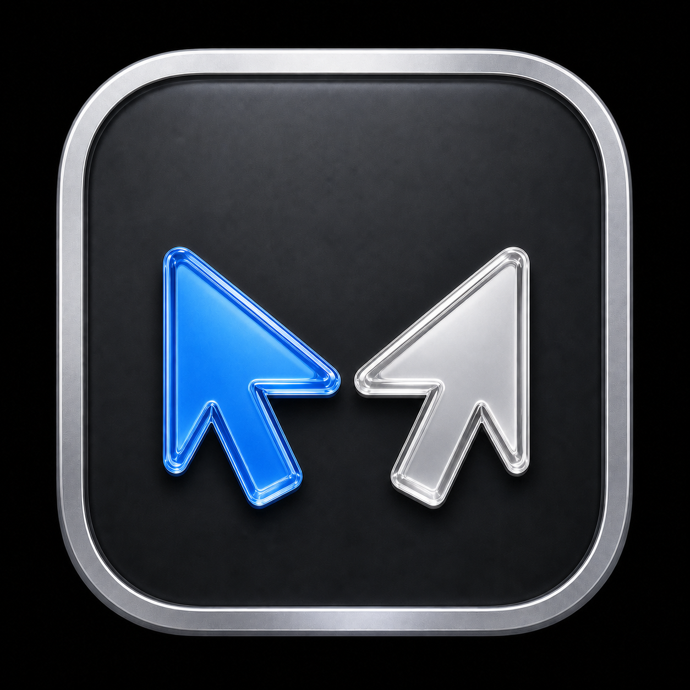

# DoubleMouse

<p align="center">
  
</p>

Ever wondered how to be faster on your Mac? What if you had two physical mice, each with its own pointer?

**DoubleMouse** is an open-source macOS menu bar app for two pointing devices: two physical mice, or your MacBook's built-in trackpad plus one external mouse. Both pointers move simultaneously, and each can click, scroll, and drag. It is also handy in classrooms and support sessions, where teacher and student can each keep a hand on the computer without negotiating custody of the cursor.

## Download

- [Download DoubleMouse 1.2.1 for macOS from GitHub](https://github.com/franciscoxc/DoubleMouse/releases/download/v1.2.1/DoubleMouse-1.2.1.dmg)
- [Download mirror and project page](https://apps.franxc.com/doublemouse/)

The app requires two pointing devices: two physical mice, or the built-in MacBook trackpad plus one external mouse. The downloadable build supports Apple Silicon and Intel Macs running macOS 13 or later.

## Install

1. Open the DMG and drag DoubleMouse to Applications.
2. Launch DoubleMouse and grant Accessibility permission when macOS asks.
3. If the blue pointer does not react, also enable DoubleMouse under System Settings > Privacy & Security > Input Monitoring.
4. Use `Set Blue Pointer From Next Movement` from the menu bar when you need to assign a different device.

The published DMG is ad-hoc signed but not notarized. macOS may require you to approve the first launch under System Settings > Privacy & Security.

## Features

- Truly simultaneous movement of the normal macOS cursor and the blue pointer.
- Independent left and right clicks for both physical devices.
- Vertical and horizontal scrolling at the blue pointer location.
- Drag-and-drop with either pointer.
- Adjustable blue pointer speed and optional acceleration, so a high-DPI mouse can be matched to the system cursor.
- The chosen blue device is remembered between launches.
- External USB and Bluetooth mouse support.
- MacBook trackpad plus external mouse support when macOS exposes both HID devices.
- Compact menu bar device selection.
- No analytics, accounts, network access, or kernel extension.

## How It Works

DoubleMouse opens HID devices independently and takes exclusive user-space ownership of the selected blue-pointer device. macOS continues to own the normal cursor, while DoubleMouse draws the blue pointer and emits its actions at the correct screen coordinates.

The implementation uses public AppKit, IOKit, Accessibility, and CoreGraphics APIs. It does not install a driver or system extension.

## Limitations

- macOS still has one global mouse-button state, so two simultaneous drag operations are not supported.
- Some games, remote desktops, canvases, or custom controls may reject synthetic pointer events.
- The blue device is remembered by USB/Bluetooth port, so moving a mouse to a different port clears the selection.
- The public DMG is not notarized until a Developer ID certificate is available.

## Run From Source

```sh
swift run DoubleMouse
```

The pointer scaling curve has a self-check:

```sh
swift run DoubleMouse --selftest
```

When running from Terminal, macOS assigns the relevant privacy permissions to Terminal. The packaged app requests them as DoubleMouse.

## Build The DMG

```sh
DEVELOPER_DIR=/Applications/Xcode.app/Contents/Developer scripts/package-release.sh 1.1.1
```

The script uses only native macOS tools and writes the DMG plus SHA-256 checksum to `dist/`. Without arguments it signs ad hoc, which needs no certificate but leaves the first launch behind a Gatekeeper warning.

## Notarize The DMG

Notarization removes that warning. It needs a Developer ID Application certificate, which is not the same as the Apple Development certificate Xcode creates for local builds, and a stored notarytool credential profile:

```sh
xcrun notarytool store-credentials doublemouse --apple-id <apple-id> --team-id <team-id>
```

That command prompts for an app-specific password, generated at appleid.apple.com, and keeps it in the login keychain. Then build with both variables set:

```sh
CODESIGN_IDENTITY="Developer ID Application: <name> (<team-id>)" \
NOTARY_PROFILE=doublemouse \
DEVELOPER_DIR=/Applications/Xcode.app/Contents/Developer \
scripts/package-release.sh <version>
```

The script then signs with the hardened runtime, submits the disk image, waits for the result, staples the ticket, and verifies the image the way Gatekeeper does. The checksum is written after stapling, since stapling rewrites the disk image.

Signing says nothing about the source, which stays MIT and complete: it only certifies who built one particular binary. A build you make yourself is ad-hoc signed and not notarized, so macOS will ask you to approve its first launch even though the published DMG opens without a prompt. That difference is expected. The signing key belongs to the maintainer and cannot be reproduced from this repository, which is the point of it.

## Contributing

Issues and pull requests are welcome. Include your macOS version, Mac model, pointing-device models, connection types, and whether the problem affects movement, clicks, scroll, or dragging.

## License

MIT. See [LICENSE](LICENSE).
